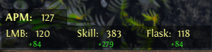

# Path of Exile Click Counter
An application to track clicks and skill usage while playing Path of Exile. 

Inspired by [timwalsh](https://github.com/timtwalsh/ClickCountR)'s AHK script

## Features
* Click and Keypress tracking

    * Track clicks, skill and flask usage over time

    * Resettable session tracking

    * Only tracks when Path of Exile is active

* Automatically shows and hides when Path of Exile is open/closed

    * Can choose not to show tracker even with Path of Exile is open

* Automatically loads your keybinds

* Settings and actions are available by right-clicking the system tray icon

## Screenshots

Showing session stats:

Without session stats:

Settings:

## Installation

[Download](https://github.com/crypticism/POEClickCounter/releases) and extract the zip of the project to your desired location.

Double click the POEClickCounter.exe to run the application.

## Safety

POE Click Counter operates by hooking into mouse and keyboard events system-wide. It then discards any clicks or keypresses that occur in any window other than Path of Exile.

The relevant functions for [mouse presses](https://github.com/crypticism/POEClickCounter/blob/main/POEClickCounter/gui/StackedDisplayContainer.cpp#L92) and [keyboard inputs](https://github.com/crypticism/POEClickCounter/blob/main/POEClickCounter/gui/StackedDisplayContainer.cpp#L142) are here. (These locations may change in the future, but the functions are named `StackedDisplayContainer::mouse_hook` and `StackedDisplayContainer::keyboard_hook`)

The functions operate as follows

1. Discard any event that is not either a mouse up or key up event.
2. Get the active window based on your cursor's current position (relevant function [here](https://github.com/crypticism/POEClickCounter/blob/main/POEClickCounter/utils/uitls.h#L34), named `get_active_window`)
3. Stop processing the event if the active window is not named "Path of Exile"
4. Increment the appropriate values if it is a mouse click or matches a bound skill/flask if it is a keypress
5. Pass the event back to the operating system

## Disclaimer

This is my first time writing a c++ application, working with a GUI library or working with the windows API. There are likely bugs, but so far it seems stable.